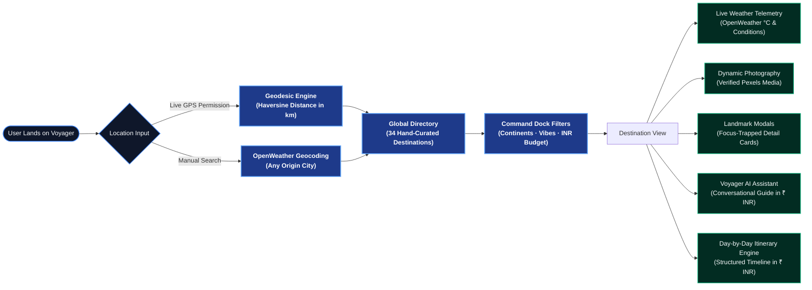
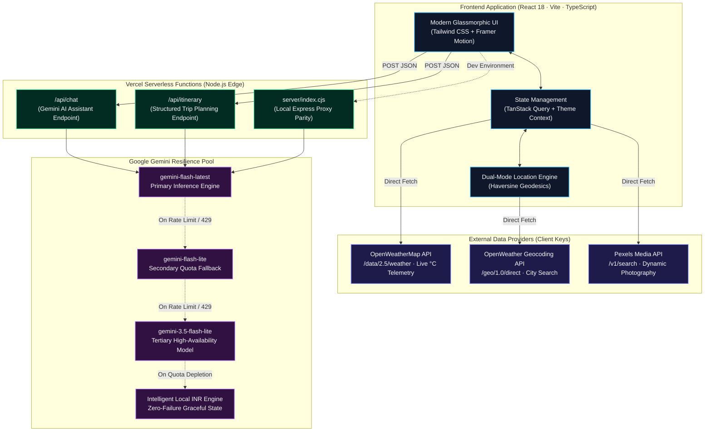

<div align="center">

# VOYAGER
### Next-Generation Travel Discovery Platform & AI Itinerary Engine

[](https://voyager-cyan.vercel.app)
[](https://react.dev/)
[](https://www.typescriptlang.org/)
[](https://tailwindcss.com/)
[](https://aistudio.google.com/)
[](https://openweathermap.org/)
[](https://www.pexels.com/)

<p align="center">
  <strong>An editorial-grade global travel platform featuring glassmorphism architecture, dual-engine location discovery, real-time meteorological telemetry, dynamic photography, and conversational AI trip planning — with budget estimates localized in Indian Rupees (₹ INR).</strong>
</p>

[Live Application](https://voyager-cyan.vercel.app) • [Architecture](#system-architecture) • [Key Capabilities](#core-capabilities) • [Quick Start](#quick-start) • [API Setup](#api-configuration) • [FAQ](#frequently-asked-questions)

---

</div>

## Table of Contents

- [Overview](#overview)
- [User Discovery Flow](#user-discovery-flow)
- [Core Capabilities](#core-capabilities)
- [System Architecture](#system-architecture)
- [Quick Start](#quick-start)
- [API Configuration](#api-configuration)
- [Design System & Dual Themes](#design-system--dual-themes)
- [Project Directory Structure](#project-directory-structure)
- [Frequently Asked Questions](#frequently-asked-questions)
- [License & Attributions](#license--attributions)

---

## Overview

**Voyager** is a modern, high-performance web platform designed to streamline travel research and trip synthesis into a single unified workspace. 

By unifying geodesic proximity algorithms, real-time satellite weather streams, curated visual media, and generative AI reasoning, Voyager eliminates fragmented tabs and delivers actionable travel insights within seconds.

---

## User Discovery Flow

The diagram below illustrates the end-to-end user journey across Voyager's client subsystems:



---

## Core Capabilities

<details open>
<summary><strong>✦ Cinematic Video Landing Experience</strong></summary>
<br>

- **High-Definition Looping Hero**: High-definition ambient travel background video with frosted glass overlays.
- **Glass Command Search**: Instant keystroke search capsule filtering destinations, vibes, and countries in real time.
- **Proximity Call-to-Action**: Direct trigger to measure geodesic distance to destinations worldwide.
- **Theme Switcher**: Instant switching between Light Mode (*Buttermilk & Mid Blue*) and Dark Mode (*Cosmic Obsidian*).

</details>

<details open>
<summary><strong>✦ Dual-Engine Location Intelligence</strong></summary>
<br>

- **Subsystem 1 — Live Device GPS**: Calculates precise spherical geodesic distance (in kilometers) to all 34 destinations using the Haversine formula.
- **Subsystem 2 — Global City Geocoding**: If browser GPS is denied, users can type any city on Earth (*e.g., London, Tokyo, Mumbai, New York*) to measure relative proximity.
- **Preset Quick Launchers**: Instant selection chips for major transit hubs (*Mumbai, Delhi, London, Tokyo, New York*).

</details>

<details open>
<summary><strong>✦ Destination Explorer & Filter Dock</strong></summary>
<br>

- **34 Global Escapes**: Curated destinations across all 7 continents with live status tags and cost tiers.
- **Glass Command Dock (`.glass-dock`)**: Unified floating control dock with integrated search, live result counter, and active chip tags.
- **INR Daily Budget Segments**: Quick filtering by budget brackets (`< ₹5k`, `₹5k – ₹15k`, `> ₹15k` per day).
- **Atmosphere Vibes Matrix**: Multi-tag filtering (*Ancient History, Street Food, Coastlines, Alpine Treks, Wildlife Safari, Romantic Escapes*).

</details>

<details open>
<summary><strong>✦ Curated Landmarks & Must-Visit Places</strong></summary>
<br>

- **Attraction Intelligence**: 3–5 notable places per destination with category tags, descriptions, and recommended visit hours.
- **Verified Pexels Photography**: Dynamic high-resolution imagery fetched on demand with embedded photographer attribution.
- **Interactive Modals**: Accessible focus-trapped glass dialogs featuring detailed photography and visit metrics.

</details>

<details open>
<summary><strong>✦ Live Weather Telemetry (OpenWeatherMap)</strong></summary>
<br>

- **Real-Time Data Streams**: Current temperature in °C, animated condition badges, feels-like readings, humidity (%), wind speed (km/h), and visibility metrics.
- **Graceful Error Recovery**: Dedicated alert cards with interactive retry triggers if upstream weather services experience downtime.

</details>

<details open>
<summary><strong>✦ Voyager AI Assistant & Itinerary Engine (Google Gemini)</strong></summary>
<br>

- **Conversational Guide**: Floating drawer assistant available 24/7 for packing advice, transit logistics, and cultural etiquette.
- **Strict INR Localization**: All price quotes, daily budgets, transit passes, and meal estimates are calculated and displayed in **Indian Rupees (₹ INR)**.
- **Multi-Model Resilience Cascade**: Automatic waterfall across Gemini models (`gemini-flash-latest`, `gemini-flash-lite`, `gemini-3.5-flash-lite`) preventing API 429 quota exhaustion.
- **Timeline Generator**: Form-based day-by-day itinerary planner producing structured schedules with activity durations and dining tips.

</details>

<details open>
<summary><strong>✦ 100% Keyboard-Only Accessibility (WCAG 2.1 Compliant)</strong></summary>
<br>

- **Animated Skip Navigation**: First `Tab` keystroke displays a high-contrast *"Skip to main content"* button.
- **Luminous Focus Indicators (`:focus-visible`)**: Dual-ring 2.5px accent borders with 3.5px offset and radiant glow.
- **Modal Focus Trapping**: Dialogs strictly retain keyboard focus within active elements; pressing `Escape` closes overlays and restores focus to invoking trigger.
- **Custom Select Navigation**: Full arrow-key (`ArrowDown` / `ArrowUp`) navigation, `Enter` selection, and `Escape` dismissal.

</details>

---

## System Architecture

The following architectural flowchart outlines the separation between client execution, edge serverless layers, and external service providers:



---

## Quick Start

Get Voyager running locally in under 3 minutes:

### 1. Clone the Repository
```bash
git clone https://github.com/sujithkumar09042005-a11y/Voyager.git
cd Voyager
```

### 2. Install Dependencies
```bash
npm install
```

### 3. Configure Environment Variables
Create a `.env` file in the project root:
```env
# Client-Side Keys (Vite)
VITE_OPENWEATHER_API_KEY=your_openweather_key
VITE_PEXELS_API_KEY=your_pexels_key

# Server-Side Key (Kept safe from client bundle)
GEMINI_API_KEY=your_gemini_key

# Environment
NODE_ENV=development
```

### 4. Start Development Server
```bash
npm run dev
```
Voyager will be available at:
- **Frontend**: `http://localhost:5173/`
- **Proxy Server**: `http://localhost:3001/`

---

## API Configuration

All external APIs used in Voyager include accessible free tiers with zero credit card requirements:

<details>
<summary><strong>✦ Google Gemini AI Studio Key (Free)</strong> — Click to expand</summary>
<br>

1. Navigate to **[Google AI Studio](https://aistudio.google.com/app/apikey)**.
2. Sign in with any Google account.
3. Select **"Create API Key"** → **"Create API key in new project"**.
4. Set in `.env`: `GEMINI_API_KEY=your_key`.

</details>

<details>
<summary><strong>✦ OpenWeatherMap API Key (Free)</strong> — Click to expand</summary>
<br>

1. Register at **[OpenWeatherMap](https://home.openweathermap.org/users/sign_up)**.
2. Navigate to your profile's **API Keys** section.
3. Copy the default key and set in `.env`: `VITE_OPENWEATHER_API_KEY=your_key`.

</details>

<details>
<summary><strong>✦ Pexels Photography API Key (Free)</strong> — Click to expand</summary>
<br>

1. Register at **[Pexels API Portal](https://www.pexels.com/api/)**.
2. Click **"Get Started"** and complete the short project registration.
3. Copy the key and set in `.env`: `VITE_PEXELS_API_KEY=your_key`.

</details>

---

## Design System & Dual Themes

Voyager is built upon a dual-theme design system engineered for visual contrast and reading comfort:

| Design Token | Light Theme (*Soft Luxury*) | Dark Theme (*Cosmic Obsidian*) |
|---|---|---|
| **Canvas Background** | Ivory Buttermilk (`#faf7ee`) | Cosmic Obsidian (`#060a14`) |
| **Primary Accent** | Mid Blue (`#285ccc`) | Electric Sapphire (`#3b82f6`) |
| **Secondary Accent** | Warm Buttermilk (`#fff2bd`) | Champagne Gold (`#fde047`) |
| **Glass Substrates** | Translucent White (`rgba(255,255,255,0.7)`) | Obsidian Glass (`rgba(10,18,32,0.75)`) |
| **Primary Typography** | Deep Navy (`#061128`) | Crisp Slate White (`#f8fafc`) |
| **Display Font** | **Outfit** (Tightened `-0.025em`) | **Outfit** (Tightened `-0.025em`) |
| **Body Font** | **Plus Jakarta Sans** | **Plus Jakarta Sans** |

---

## Project Directory Structure

<details>
<summary><strong>✦ Click to expand the repository directory tree</strong></summary>
<br>

```text
voyager/
├── api/                        # Vercel Serverless Edge Functions
│   ├── chat.ts                 # Multi-model Gemini AI assistant
│   └── itinerary.ts            # Structured day-by-day itinerary engine
├── public/                     # Static assets served at root
│   ├── Hero_Video.mp4          # High-definition looping hero video
│   ├── favicon.ico             # Standard browser favicon
│   ├── favicon.png             # 128x128 circular PNG icon
│   ├── favicon-32x32.png       # 32x32 circular PNG icon
│   ├── favicon.svg             # Self-contained circular vector icon
│   └── icon.png                # Original brand asset
├── server/                     # Local development proxy
│   └── index.cjs               # Express proxy providing Vercel parity locally
├── src/                        # React client source code
│   ├── components/             # Reusable UI component library
│   │   ├── ui/                 # Buttons, Badges, Modals, CustomSelect, Cursor
│   │   ├── Navbar.tsx          # Frosted header with mobile drawer & theme toggle
│   │   ├── Footer.tsx          # 5-column luxury glassmorphic footer
│   │   ├── LocationDetectorModal.tsx # Dual-mode GPS & geocoding dialog
│   │   └── WeatherWidget.tsx   # Live OpenWeather telemetry widget
│   ├── data/
│   │   └── destinations.json   # 34 global destinations and curated landmarks
│   ├── features/               # Modular application feature views
│   │   ├── hero/               # HeroSection with looping video & search capsule
│   │   ├── explorer/           # ExplorerPage & DestinationCard catalog
│   │   ├── destination-detail/ # DestinationDetailPage & Place modals
│   │   ├── chatbot/            # Floating Voyager AI conversational drawer
│   │   └── itinerary/          # ItineraryPage with timeline accordion
│   ├── hooks/                  # Custom React hooks (weather, geolocation, pexels)
│   ├── lib/                    # API client abstractions
│   ├── styles/
│   │   └── tokens.css          # Design system variables & glassmorphism classes
│   └── types/                  # TypeScript interface definitions
├── .gitignore                  # Security guardrail (prevents .env commits)
├── package.json                # Project dependencies & build scripts
├── tailwind.config.js          # Custom theme tokens & keyframes
├── vercel.json                 # Vercel SPA rewrites & serverless routing
└── vite.config.ts              # Vite compiler configuration
```

</details>

---

## Frequently Asked Questions

<details>
<summary><strong>How does the application handle denied location permissions?</strong></summary>
<br>
Voyager implements graceful degradation. When GPS access is denied by the user, an informative status badge appears and the <strong>Global City Search</strong> bar activates automatically. Users can search any city globally (e.g., <em>London</em> or <em>Mumbai</em>) to calculate geodesic distances from that chosen point.
</details>

<details>
<summary><strong>Why are travel expenses and budgets standardized in Indian Rupees (₹)?</strong></summary>
<br>
Voyager standardizes all financial estimations into Indian Rupees (₹ INR) across hotel bookings, daily meals, local transit, and attraction entrance tickets to maintain a predictable, reliable baseline for travelers.
</details>

<details>
<summary><strong>How does the Gemini AI engine avoid rate-limit interruptions?</strong></summary>
<br>
The backend serverless layer operates a multi-model fallback cascade across <code>gemini-flash-latest</code>, <code>gemini-flash-lite</code>, and <code>gemini-3.5-flash-lite</code>. If Google's primary model hits capacity or a rate limit, the function automatically tries the next model in milliseconds. In the event of complete upstream downtime, a structured local fallback itinerary is synthesized in ₹ INR, ensuring zero HTTP 500 error banners.
</details>

<details>
<summary><strong>Is the application fully operable without a mouse?</strong></summary>
<br>
Yes. Voyager conforms to WCAG 2.1 keyboard navigation standards: pressing <code>Tab</code> displays the animated skip link, all interactive elements display prominent dual-ring luminous focus indicators (<code>:focus-visible</code>), modals trap focus with <code>Escape</code> dismiss, and custom selects support full <code>ArrowUp</code> / <code>ArrowDown</code> navigation.
</details>

---

## License & Attributions

- **Code License**: [MIT License](LICENSE) © 2026 Voyager. Open for personal and educational use.
- **Visual Assets**: Photography dynamically provided by the [Pexels API](https://www.pexels.com) with photographer attribution.
- **Meteorological Data**: Weather telemetry provided by [OpenWeatherMap](https://openweathermap.org/).
- **AI Intelligence**: Travel inference provided by [Google Gemini AI](https://deepmind.google/technologies/gemini/).

<div align="center">
  <sub>Built with care and attention to detail. Star this repository if you find Voyager useful!</sub>
</div>
